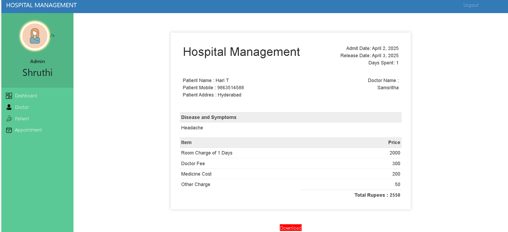

# Hospital Management System

**Screenshots**

**Homepage**

.

**Admin Dashboard**

**Doctor's List**

**Patient's List**

**Invoice**

**Functions**

# Admin
- Signup their account. Then Login (No approval Required).
Can register/view/approve/reject/delete doctor (approve those doctor who applied for job in their hospital).
Can admit/view/approve/reject/discharge patient (discharge patient when treatment is done).
Can Generate/Download Invoice pdf (Generate Invoice according to medicine cost, room charge, doctor charge and other charge).
Can view/book/approve Appointment (approve those appointments which is requested by patient).
# Doctor
Apply for job in hospital. Then Login (Approval required by hospital admin, Then only doctor can login).
Can only view their patient details (symptoms, name, mobile ) assigned to that doctor by admin.
Can view their discharged(by admin) patient list.
Can view their Appointments, booked by admin.
Can delete their Appointment, when doctor attended their appointment.
# Patient
Create account for admit in hospital. Then Login (Approval required by hospital admin, Then only patient can login).
Can view assigned doctor's details like ( specialization, mobile, address).
Can view their booked appointment status (pending/confirmed by admin).
Can book appointments.(approval required by admin)
Can view/download Invoice pdf (Only when that patient is discharged by admin).
